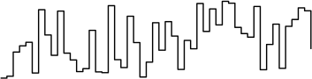

Shor's Factoring Algorithm
==========================

Shor's algorithm is an algorithm for finding the prime factors of a given integer, discovered by Peter Shor [[@shor_polynomial-time_1999]]. It is a particularly celebrated quantum algorithm, due largely to the relevance of the integer factorisation problem to our everyday lives - the majority of encryption systems used in finance and electronic communication are reliant on the presumed difficulty of finding the prime factors of some very large integers.

The way in which Shor's algorithm works is dependent on some non-trivial results from number theory, which we'll go over first. A full treatment is rather involved - see, for example, Appendix 4 of Nielsen and Chuang [[@nielsen_quantum_2010]], for the full story.$\newcommand{\Mod}[1]{\ (\text{mod}\ #1)}$

## From Period-Finding to Factorisation

Essentially, Shor's algorithm relies on the following fact: *finding the prime factors of some number* $N$ *is easy if we can find the period of* $f$, where:

$$f(x)=a^x \Mod{N}$$ 

Where by the *period* we mean the number $r$ that satisfies $f(x+r)=f(x)$, and where $a$ is some integer less than $N$. $f$ is often known as the modular 
<sidenote>
Modular arithmetic is a form of arithmetic for integers in which the number line wraps back around to 0 upon reaching a certain number. This is familiar from reading an analogue clock! For example, 5 hours after 10:00 is not 15:00, but is 3:00 - where we've got 3 from the remainder of 15 divided by 12.
The convention is to write this kind of addition as follows:
$$10 + 5 \Mod{12} = 3$$ Where the number after the $\textrm{mod}$ is the number at which the number line goes back to 0.
</sidenote>
exponentiation function. Let's consider why knowing its period is useful for the factorisation problem. 

Clearly, there exist only $N$ numbers $\text{mod}\ N$, so it follows that for some number $x$ there exists a $y > x$ such that $a^y=a^x \Mod{N}$, where $a$ is defined as before. So:

$$a^x (a^{y-x} - 1) \Mod{N} = 0$$

Now we can write $r = y - x$ and, furthermore, we impose that $a$ shares no factors with $N$. This latter fact clearly means $a^x$ also shares no factors with $N$, and hence from the above it is easy to see that:

$$a^r = 1 \Mod{N}$$

It follows from this that our function $f(x)$ has a period of the smallest value of $r$ that satisfies the above<sidenote>
$f(x)$ is quite an unusual function and unlike, say, $\sin(x)$ or $\cos(x)$, it's not possible to tell its period by looking at a small portion of it. It takes shapes like this:  It should be apparent that finding its period is not easy!
</sidenote>. But what does this have to do with the factors of $N$? Define $\alpha = a^{r/2} \Mod{N}$, and then write:

$$\begin{align}
\alpha^2 & = 1 \Mod{N} \\
\alpha^2 - 1 = (\alpha + 1)(\alpha - 1) & = 0 \Mod{N}
\end{align}$$

So, one of $(\alpha \pm 1)$ divides $N$. It can be shown that we can write the greatest common divider of 2 integers $a$ and $b$, denoted $\gcd(a,b)$, as $ax + by$ where $x,y$ are integers. Hence, if $c$ divides both $a$ and $b$, it also divides $ax + by = \gcd(a,b)$. Factors of $N$ obviously will also divide whichever of $(\alpha \pm 1)$ divides $N$, and so calculating<sidenote>
A very beautiful and efficient way to find the greatest common divisor of 2 integers is *Euclid's algorithm*. This can be elegantly written as a recursion:
$$\gcd(a,b) =
\begin{cases}
a & b = 0 \\
\gcd(b, a \Mod{b}) & b > 0
\end{cases}$$
</sidenote>
$\gcd(\alpha \pm 1, N)$ gives us a non-trivial factor of $N$. 

Recalling that $\alpha = a^{r/2} \Mod{N}$, then having found $r$ (by yet unspecified means) we require 2 pieces of good luck in order to use the above to find the factors of $N$:

- $r$ must be even - only then can we use $a^{r/2}$
- $a^{r/2} \neq \pm 1 \Mod{N}$ - these are the trivial solutions to $\alpha^2 = 1 \Mod{N}$

Provided our luck holds (and if it doesn't, we have to start again), this means that we can factor $N$ with repeated application of the following algorithm [[@nielsen_quantum_2010]]:

1. Return 2 if $N$ is even
2. Determine whether $N = a^b$ for integers $a \geq 1$ and $b \geq 2$, and if so then return $a$ as a factor<sidenote>Note that earlier we required $a^x$ to share no factors with $N$, so we have to eliminate these special cases</sidenote>.
3. Choose a random integer $a \in [1, N-1]$. Compute $\gcd(a, N)$ and if this is greater than 1 then return it.
4. Find $r$, the period of $f(x) = a^x \Mod{N}$.
5. Check whether $r$ is even and whether $x^{r/2} \neq \pm 1 \Mod{N}$. If so, then calculate $\gcd(x^{r/2} \pm 1, N)$ and test to see which of these is a non-trivial factor, returning this factor. If not, then the algorithm has failed and must be tried again.

It's interesting to see how often our luck holds - if it's less than 50% of the time then the algorithm isn't very good. It can be shown, with some work, that:

$$\Pr\left(r \text{ is even and } x^{r/2} \neq \pm 1 \Mod{N} \right) = 1 - \frac{1}{2^m}$$

Where $m$ is the number of prime factors of $N$. This means that we succeed at least $3/4$ of the time!

This rather unexpected method for factorisation is all very well, but we've glossed over perhaps the most elusive step - finding the value of $r$. Whilst quantum mechanics doesn't seem to have very much in common with number theory, it certainly involves a lot of waves, and waves certainly involve a lot of periodicity: we will show that $r$ can be found efficiently by quantum computational methods.

## References
